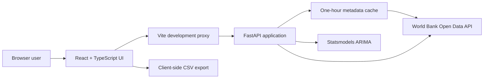

<div align="center">

# World Bank Economic Dashboard

Explore live macroeconomic indicators, visualize country-level time series, export clean data, and generate ARIMA forecasts through a typed full-stack application.

[](https://github.com/viniciusrodriguesai/worldbank-economic-dashboard/actions/workflows/ci.yml)
[](LICENSE)
[](https://www.python.org/)
[](https://www.typescriptlang.org/)
[](https://react.dev/)
[](https://fastapi.tiangolo.com/)

[Getting started](#getting-started) |
[Architecture](#architecture) |
[Documentation](#documentation-map) |
[API reference](#api-reference) |
[Testing](#testing-and-quality) |
[Contributing](#contributing)

</div>

---

## Overview

World Bank Economic Dashboard is a full-stack data application built for students, researchers, analysts, and developers who need a focused interface for World Bank Open Data.

The application retrieves official indicator data over HTTPS, validates and normalizes it with Pandas, exposes typed FastAPI contracts, and renders the result through a strict TypeScript and React interface. Users can select a country and indicator, define a historical period, inspect the country on a map, download the resulting series, and fit a five-year ARIMA forecast.

This repository intentionally favors a small, understandable architecture:

- Live World Bank data instead of a stale bundled database.
- Python for data preparation and statistical modeling.
- TypeScript for safe browser-side API contracts.
- Automated tests for both application layers.
- No credentials, proprietary datasets, or paid services required.

## Highlights

| Capability | Implementation |
| --- | --- |
| Live economic data | World Bank Open Data REST API over HTTPS |
| Historical analysis | Country, indicator, and year-range selection |
| Visualization | Plotly time-series charts loaded on demand |
| Geographic context | Leaflet map driven by ISO2 country metadata |
| Forecasting | Statsmodels ARIMA with configurable fitting period |
| Export | Excel-compatible UTF-8 CSV downloads |
| Type safety | Pydantic response models and strict TypeScript |
| Reliability | Abortable requests, timeouts, cache locking, and explicit error states |
| Quality gates | Pytest, Vitest, TypeScript checking, production build, and GitHub Actions |

## Architecture



### Request flow

1. The frontend loads country and indicator metadata through `/countries` and `/indicators`.
2. FastAPI serves fresh in-memory metadata or refreshes an expired cache under a concurrency lock.
3. A country, indicator, or period change cancels any obsolete browser request.
4. The `/data` route retrieves, validates, converts, filters, and sorts observations from the World Bank.
5. The browser renders historical points and can export the same validated records as CSV.
6. A forecast request fits ARIMA to the selected historical period and returns only future observations.
7. Plotly and Leaflet are code-split so they are downloaded only when the interface needs them.

### Technology decisions

| Layer | Technology | Why it is used |
| --- | --- | --- |
| API | FastAPI | Typed, documented, high-performance Python HTTP layer |
| Validation | Pydantic | Runtime response validation and OpenAPI schemas |
| Data processing | Pandas | Reliable tabular normalization and filtering |
| Forecasting | Statsmodels ARIMA | Mature time-series modeling in the Python ecosystem |
| HTTP upstream | Requests | Session reuse, explicit timeouts, and HTTPS |
| UI | React 19 | Component-oriented interactive interface |
| Frontend language | TypeScript | Compile-time API and component contract safety |
| Tooling | Vite 8 | Fast development server and optimized production build |
| Charts | Plotly basic distribution | Interactive line charts without the full Plotly bundle |
| Maps | React Leaflet | Lightweight geographic context with OpenStreetMap tiles |
| Tests | Pytest + Vitest | Deterministic validation for backend and frontend behavior |

## Current scope

Implemented:

- One country and one indicator per analysis.
- Historical World Bank observations.
- Country map.
- ARIMA forecast.
- CSV export.
- Responsive chart sizing.
- Typed error handling and loading states.
- Backend and frontend automated tests.

Not currently implemented:

- Multi-country comparison.
- Region comparison views.
- Prophet models.
- User accounts or saved dashboards.
- Offline mode or persistent local data storage.
- Financial, investment, or policy recommendations.

## Project structure

```text
worldbank-economic-dashboard/
|-- .github/
|   `-- workflows/
|       `-- ci.yml                    # Automated backend and frontend validation
|-- backend/
|   |-- app.py                        # FastAPI routes, CORS, lifespan, and cache
|   |-- data_loader.py                # World Bank client, normalization, and ARIMA
|   |-- models.py                     # Pydantic response contracts
|   |-- requirements.txt              # Minimal runtime dependencies
|   |-- requirements-dev.txt          # Runtime and testing dependencies
|   `-- tests/
|       `-- test_api.py               # Deterministic API contract tests
|-- frontend/
|   |-- public/                       # Static image assets
|   |-- src/
|   |   |-- components/               # Selectors, charts, map, and CSV export
|   |   |-- pages/
|   |   |   |-- Dashboard.tsx
|   |   |   `-- Dashboard.test.tsx
|   |   |-- test/setup.ts             # Browser test isolation
|   |   |-- api.ts                    # Typed Axios client
|   |   |-- api.test.ts               # HTTP contract tests
|   |   |-- types.ts                  # Shared frontend types
|   |   `-- main.tsx                  # Browser entrypoint
|   |-- index.html
|   |-- package.json
|   |-- tsconfig.json
|   `-- vite.config.ts
|-- .env.example                      # Backend environment template
|-- .gitattributes                    # Stable cross-platform line endings
|-- .gitignore
|-- LICENSE
|-- pyproject.toml                    # Pytest and coverage configuration
`-- README.md
```

## Documentation map

Documentation is organized by ownership boundary. Start with this file for the complete product view, then use the nearest directory guide when changing a specific layer.

| Guide | Use it for |
| --- | --- |
| [Project guide](README.md) | Product scope, architecture, setup, configuration, API reference, forecasting, quality, operations, security, and contribution workflow. |
| [Backend guide](backend/README.md) | FastAPI architecture, environment variables, route behavior, World Bank integration, caching, forecasting, errors, and backend operations. |
| [Backend test guide](backend/tests/README.md) | Test isolation, mocked upstream responses, fixtures, coverage policy, test structure, and adding backend cases. |
| [Frontend guide](frontend/README.md) | Vite workspace setup, scripts, environment configuration, dependencies, testing, builds, deployment, and troubleshooting. |
| [Frontend source guide](frontend/src/README.md) | TypeScript module boundaries, dependency direction, shared contracts, HTTP isolation, testing placement, and source contribution rules. |
| [Component guide](frontend/src/components/README.md) | Selector, Plotly, Leaflet, and CSV contracts plus accessibility, performance, dependency, and component testing rules. |
| [Page guide](frontend/src/pages/README.md) | Dashboard state, request lifecycles, cancellation, data transformations, lazy rendering, errors, and orchestration tests. |
| [CI workflow guide](.github/workflows/README.md) | GitHub Actions triggers, permissions, jobs, caches, local parity, failure diagnosis, runtime upgrades, and workflow maintenance. |

Recommended reading paths:

- **First-time contributor:** project guide, then the frontend or backend guide for the layer being changed.
- **Backend API change:** backend guide, backend test guide, and API reference in this file.
- **Frontend workflow change:** frontend source guide, page guide, and component guide as applicable.
- **Build or CI failure:** relevant layer guide followed by the CI workflow guide.
- **Production review:** configuration, performance, troubleshooting, and security sections in this file plus both layer guides.

## Getting started

### Prerequisites

| Tool | Supported version |
| --- | --- |
| Python | 3.11 or newer |
| Node.js | 22.13 or newer |
| npm | 10 or newer |
| Git | Any current release |

The running application needs internet access to reach the World Bank API and OpenStreetMap tile servers.

### 1. Clone the repository

```powershell
git clone https://github.com/viniciusrodriguesai/worldbank-economic-dashboard.git
cd worldbank-economic-dashboard
```

### 2. Start the backend

#### Windows PowerShell

```powershell
python -m venv .venv
.\.venv\Scripts\Activate.ps1
python -m pip install -r backend\requirements-dev.txt
uvicorn backend.app:app --reload --port 8000
```

#### macOS or Linux

```bash
python3 -m venv .venv
source .venv/bin/activate
python -m pip install -r backend/requirements-dev.txt
uvicorn backend.app:app --reload --port 8000
```

Backend endpoints:

- API root: `http://127.0.0.1:8000`
- Swagger UI: `http://127.0.0.1:8000/docs`
- OpenAPI schema: `http://127.0.0.1:8000/openapi.json`

Use `backend/requirements.txt` instead of `requirements-dev.txt` for a runtime-only installation.

### 3. Start the frontend

Open a second terminal:

```powershell
cd frontend
npm install
npm run dev
```

Open `http://localhost:5173`.

During development, Vite proxies `/api/*` to `http://127.0.0.1:8000/*`. The browser therefore uses same-origin requests without weakening the backend CORS policy.

## Configuration

### Backend variables

Copy `.env.example` to `.env` if you need to override defaults, then start Uvicorn with `--env-file .env`.

```powershell
Copy-Item .env.example .env
uvicorn backend.app:app --reload --port 8000 --env-file .env
```

| Variable | Default | Description |
| --- | --- | --- |
| `WB_API_BASE` | `https://api.worldbank.org/v2` | Upstream World Bank API base URL |
| `CORS_ORIGINS` | `http://localhost:3000,http://localhost:5173` | Comma-separated browser origin allowlist |

### Frontend variables

Vite automatically reads `frontend/.env`.

```powershell
cd frontend
Copy-Item .env.example .env
```

| Variable | Default | Description |
| --- | --- | --- |
| `VITE_API_BASE_URL` | `/api` | Browser-visible API base URL |

For a separately deployed frontend, set `VITE_API_BASE_URL` to the public backend URL before running `npm run build`.

No API keys are required. Do not commit real secrets to either `.env` file.

## API reference

FastAPI generates the authoritative interactive specification at `/docs`.

### Endpoints

| Method | Route | Parameters | Successful response |
| --- | --- | --- | --- |
| GET | `/countries` | None | Country metadata including ISO3 and ISO2 codes |
| GET | `/indicators` | None | World Bank indicator identifiers and names |
| GET | `/data` | `country`, `indicator`, `start`, `end` | Historical `IndicatorPoint[]` |
| GET | `/forecast` | `country`, `indicator`, `start`, `end`, `years_ahead` | Future `IndicatorPoint[]` |

### Historical data example

```bash
curl "http://127.0.0.1:8000/data?country=BRA&indicator=NY.GDP.MKTP.CD&start=2000&end=2022"
```

Example response:

```json
[
  {
    "country": "Brazil",
    "indicator": "NY.GDP.MKTP.CD",
    "year": 2022,
    "value": 1920095779022.73
  }
]
```

### Forecast example

```bash
curl "http://127.0.0.1:8000/forecast?country=BRA&indicator=NY.GDP.MKTP.CD&start=2000&end=2022&years_ahead=5"
```

The forecast response contains only future years. Historical observations remain available through `/data`.

### Validation and errors

| Status | Meaning |
| --- | --- |
| `200` | Request completed successfully |
| `400` | Invalid period, insufficient forecast history, or invalid model input |
| `404` | No historical data or forecast is available for the selection |
| `422` | Query parameters failed FastAPI/Pydantic validation |
| `503` | World Bank metadata is temporarily unavailable |

The frontend displays the FastAPI `detail` message when one is available and suppresses errors from intentionally cancelled requests.

## Forecast methodology

The backend uses `statsmodels.tsa.arima.model.ARIMA` with a default order of `(1, 1, 1)`.

The pipeline:

1. Retrieves the chosen indicator for the selected country and period.
2. Converts years and values to numeric data.
3. Removes missing observations.
4. Sorts the series chronologically.
5. Rejects series with fewer than ten valid observations.
6. Fits ARIMA.
7. Returns the requested number of future annual points.

Forecasts are statistical estimates. They are not financial, investment, economic-policy, or risk-management advice.

## Testing and quality

### Backend

```powershell
.\.venv\Scripts\python.exe -m pytest
```

Pytest is configured in `pyproject.toml` with strict markers and terminal coverage reporting. Tests replace external requests with deterministic data and currently cover:

- Cached metadata responses.
- Selected period forwarding.
- Invalid period handling.
- Missing data behavior.
- ISO3 validation.
- Forecast response contracts.
- Upstream metadata failures.

### Frontend

```powershell
cd frontend
npm test
npm run build
```

The frontend suite validates:

- Country and ISO2 mapping.
- `start` and `end` request parameters.
- Direct typed array responses.
- Forecast fitting ranges.
- FastAPI error extraction.
- The selection-to-chart-to-forecast interaction.
- Client-side invalid period protection.

`npm run build` runs strict TypeScript checking before Vite creates the production bundle.

### Continuous integration

`.github/workflows/ci.yml` runs independent backend and frontend jobs for every push to `main` and every pull request targeting `main`.

The workflow uses:

- Python 3.11 with pip caching.
- Node.js 22.15 with npm caching.
- Reproducible `npm ci` installation.
- Pytest with coverage.
- Vitest.
- Strict TypeScript validation.
- Production Vite build.

## Production build

Build the frontend:

```powershell
cd frontend
npm ci
npm run build
```

Static production files are written to `frontend/dist/`.

Run the API without development reload:

```powershell
.\.venv\Scripts\uvicorn.exe backend.app:app --host 0.0.0.0 --port 8000
```

Deployment requirements:

- Serve `frontend/dist/` from a static host or CDN.
- Set `VITE_API_BASE_URL` before building when the API is on another origin.
- Add the deployed frontend URL to `CORS_ORIGINS`.
- Use an HTTPS reverse proxy in front of the API.
- Keep worker memory in mind because Pandas, SciPy, and Statsmodels are scientific dependencies.
- Do not use Uvicorn `--reload` in production.

## Performance and reliability

- A reusable HTTP session reduces upstream connection overhead.
- World Bank requests have an explicit ten-second timeout.
- Metadata is cached for one hour.
- Cache refreshes use a lock and atomic assignment.
- Startup failures are logged without hiding the OpenAPI service.
- Metadata outages return 503 without exposing internal exceptions.
- Browser requests are cancelled when filters change.
- Map and chart code is lazy-loaded.
- The frontend build uses the smaller Plotly basic distribution.
- CSV object URLs are revoked after download.

## Troubleshooting

### Selectors stay empty

Confirm that the backend terminal is running and can reach `https://api.worldbank.org`. Open `http://127.0.0.1:8000/countries` directly. A 503 response means upstream metadata could not be refreshed.

### Frontend reports a network error

Confirm both processes are running:

- FastAPI on port 8000.
- Vite on port 5173.

Also confirm that `VITE_API_BASE_URL` is `/api` for local development.

### Forecast returns 400

ARIMA requires at least ten valid observations. Select a wider historical period or an indicator with more complete coverage.

### CORS blocks a deployed frontend

Add its exact origin, including scheme and port when applicable, to `CORS_ORIGINS`. Separate multiple origins with commas.

### PowerShell blocks virtual environment activation

Activation is optional. Run executables directly:

```powershell
.\.venv\Scripts\python.exe -m pytest
.\.venv\Scripts\uvicorn.exe backend.app:app --reload --port 8000
```

## Security and data handling

- The project requires no World Bank API key.
- No user data is collected or persisted.
- No local economic dataset is shipped.
- Upstream requests use HTTPS.
- CORS uses an explicit allowlist.
- Internal metadata exceptions are logged server-side and returned as generic 503 responses.
- Environment files are ignored by Git.
- GitHub Actions uses read-only repository content permissions.

If you discover a security issue, avoid publishing sensitive details in a public issue. Contact the maintainer directly first.

## Roadmap

Potential future work, not yet implemented:

- Multi-country and regional comparisons.
- Indicator favorites and shareable dashboard URLs.
- Confidence intervals around ARIMA forecasts.
- Server-side caching for historical series.
- Paginated or searchable indicator metadata endpoints.
- Accessible design-system components.
- End-to-end browser tests.
- Container images and deployment manifests.
- Additional forecasting models evaluated against reproducible baselines.

## Contributing

Contributions are welcome.

1. Fork the repository.
2. Create a focused branch from `main`.
3. Make a small, reviewable change.
4. Add or update tests.
5. Run backend tests.
6. Run frontend tests and the production build.
7. Write a clear English commit message explaining what changed and why.
8. Open a pull request with impact, validation, and screenshots when UI behavior changes.

Before opening a pull request:

```powershell
.\.venv\Scripts\python.exe -m pytest
cd frontend
npm test
npm run build
```

## License

This project is available under the [MIT License](LICENSE).

## Data attribution

Economic indicator data is provided by the [World Bank Open Data API](https://data.worldbank.org/).

Map tiles and geographic data attribution are provided by [OpenStreetMap contributors](https://www.openstreetmap.org/copyright).

## Maintainer

**Vinicius Mangueira**

Data Science and Artificial Intelligence student at UFPB.

- GitHub: [@viniciusrodriguesai](https://github.com/viniciusrodriguesai)
- LinkedIn: [vinicius-mangueira-0b8285224](https://www.linkedin.com/in/vinicius-mangueira-0b8285224/)
- Email: [viniciusmangueira04@gmail.com](mailto:viniciusmangueira04@gmail.com)
