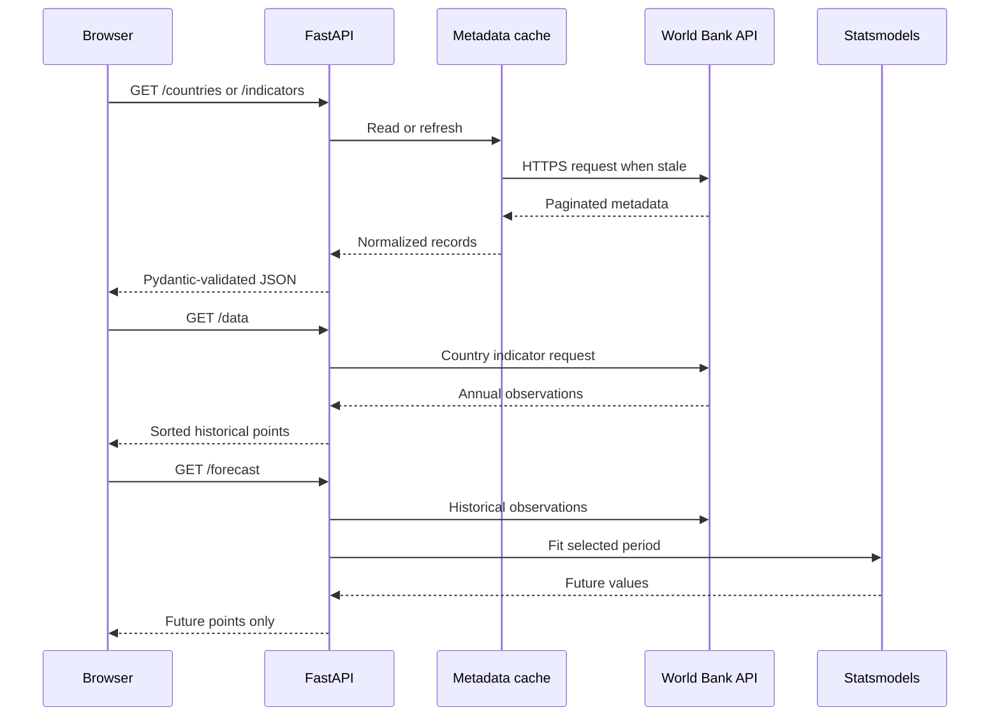

# Backend

The backend is a typed FastAPI service that retrieves live World Bank data, normalizes it with Pandas, caches metadata in memory, and produces ARIMA forecasts with Statsmodels.

See the [root documentation](../README.md) for full-stack setup, architecture, deployment, and project scope.

## Responsibilities

- Expose country and indicator metadata.
- Validate ISO3 codes, indicator identifiers, date ranges, and forecast horizons.
- Retrieve paginated World Bank records over HTTPS.
- Normalize upstream JSON into stable tabular contracts.
- Cache country and indicator metadata for one hour.
- Fit ARIMA models to valid annual observations.
- Return Pydantic-validated JSON responses.
- Convert expected failures into explicit HTTP status codes.
- Keep internal exception details in server logs.

## Modules

| File | Responsibility |
| --- | --- |
| `app.py` | FastAPI construction, lifespan, CORS, cache coordination, routes, and HTTP errors |
| `data_loader.py` | World Bank session, pagination, DataFrame normalization, and ARIMA fitting |
| `models.py` | Pydantic response contracts |
| `requirements.txt` | Minimal production dependencies |
| `requirements-dev.txt` | Production dependencies plus backend test tools |
| `tests/` | Deterministic API contract tests |

## Runtime flow



## API contracts

| Route | Response model | Notes |
| --- | --- | --- |
| `GET /countries` | `list[Country]` | Includes ISO3 `id` and `iso2Code` |
| `GET /indicators` | `list[Indicator]` | World Bank indicator ID and name |
| `GET /data` | `list[IndicatorPoint]` | Historical values between `start` and `end` |
| `GET /forecast` | `list[IndicatorPoint]` | Future ARIMA points only |

Pydantic models live in `models.py`. Route implementations must use explicit response models rather than untyped dictionaries.

## Metadata cache

Country and indicator metadata is expensive to retrieve because the World Bank endpoints are paginated.

The cache:

- Lives in process memory.
- Uses a one-hour TTL.
- Uses `time.monotonic()` for expiration checks.
- Uses a lock to prevent concurrent duplicate refreshes.
- Builds complete replacement lists before assigning global cache state.
- Attempts to preload during the FastAPI lifespan.
- Lets the API start even when preload fails.
- Retries on the next metadata request.
- Returns 503 when metadata cannot be refreshed.

Each process owns its own cache. Multi-worker deployments do not share memory.

## Upstream client

`data_loader.py` owns a reusable `requests.Session` with:

- HTTPS by default.
- A project-specific user agent.
- A ten-second timeout.
- Pagination with 1,000 records per page.
- HTTP status validation.
- Required-column validation.
- Numeric conversion and missing-value removal.

Override the upstream endpoint only for controlled testing or proxying:

```powershell
$env:WB_API_BASE = "https://api.worldbank.org/v2"
```

## Forecasting

`forecast_indicator` uses Statsmodels ARIMA.

Current rules:

- The input series is indexed by year.
- At least ten valid points are required.
- The default order is `(1, 1, 1)`.
- `years_ahead` must be between 1 and 50.
- Historical observations are not duplicated in the forecast response.
- Forecast values are returned under the same `IndicatorPoint` contract.

New forecasting models should not be added without tests, explicit model parameters, documented evaluation criteria, and clear response contracts.

## Error behavior

| Status | Backend condition |
| --- | --- |
| `400` | Reversed range, insufficient ARIMA history, or invalid model input |
| `404` | Valid selection with no observations or no forecast |
| `422` | FastAPI query validation failure |
| `500` | Unexpected internal data or forecasting failure |
| `503` | Metadata refresh cannot reach or validate the upstream service |

Do not expose raw internal exceptions in public responses. Log the exception with context and return a stable user-facing detail message.

## Local development

From the repository root:

```powershell
python -m venv .venv
.\.venv\Scripts\Activate.ps1
python -m pip install -r backend\requirements-dev.txt
uvicorn backend.app:app --reload --port 8000
```

Open:

- Swagger UI: `http://127.0.0.1:8000/docs`
- OpenAPI JSON: `http://127.0.0.1:8000/openapi.json`

The import path is `backend.app:app`. Starting Uvicorn as `app:app` from inside `backend/` is unsupported because package imports are rooted at the repository.

## Testing

```powershell
.\.venv\Scripts\python.exe -m pytest
```

Pytest configuration and coverage options are stored in the root `pyproject.toml`.

Tests must not require live internet access. Replace World Bank calls or loader functions with deterministic fixtures and verify both status codes and response contracts.

See [tests/README.md](tests/README.md) for the detailed test strategy.

## Configuration

| Variable | Default |
| --- | --- |
| `WB_API_BASE` | `https://api.worldbank.org/v2` |
| `CORS_ORIGINS` | `http://localhost:3000,http://localhost:5173` |

To load a root `.env` file:

```powershell
uvicorn backend.app:app --reload --port 8000 --env-file .env
```

## Development conventions

When changing the backend:

1. Keep World Bank transport and DataFrame operations in `data_loader.py`.
2. Keep HTTP concerns and status translation in `app.py`.
3. Add or update a Pydantic model for every public response shape.
4. Preserve HTTPS and explicit timeouts.
5. Avoid network calls in tests.
6. Add regression coverage for every corrected bug.
7. Run Pytest before committing.
8. Update the root and local documentation when contracts change.

## Production considerations

- Install `requirements.txt`, not the development file.
- Run without `--reload`.
- Place Uvicorn behind an HTTPS reverse proxy.
- Configure the exact deployed frontend origin.
- Budget memory for NumPy, Pandas, SciPy, and Statsmodels.
- Consider shared caching before scaling to many API workers.
- Add observability and historical-series caching before high-volume use.
