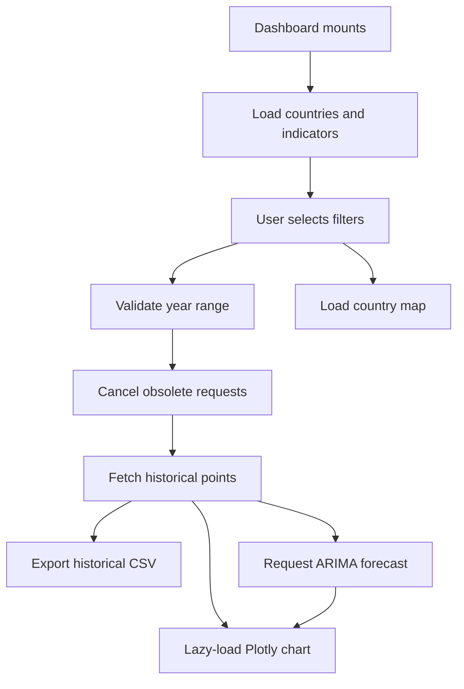

# Frontend

The frontend is a strict TypeScript and React application built with Vite. It provides country and indicator selection, historical charts, ARIMA forecast visualization, geographic context, and client-side CSV export.

See the [root README](../README.md) for full-stack setup and [src/README.md](src/README.md) for source-level conventions.

## Technology

| Tool | Role |
| --- | --- |
| TypeScript | Component and API contract safety |
| React 19 | UI state and rendering |
| Vite 8 | Development server, TypeScript build, and code splitting |
| Axios | Typed HTTP requests, timeouts, and cancellation |
| React Select | Searchable controlled selectors |
| Plotly basic distribution | Interactive time-series charts |
| React Leaflet | Country map and OpenStreetMap tiles |
| Vitest | Unit and integration-style component tests |
| Testing Library | User-oriented DOM interaction assertions |

## Commands

Install reproducibly:

```powershell
npm ci
```

Start development:

```powershell
npm run dev
```

Run tests once:

```powershell
npm test
```

Run tests in watch mode:

```powershell
npm run test:watch
```

Type-check and build production assets:

```powershell
npm run build
```

Preview the generated build:

```powershell
npm run preview
```

## Development server

Vite runs at `http://localhost:5173`.

The development proxy rewrites:

```text
Browser request:  /api/data
Backend request:  http://127.0.0.1:8000/data
```

This keeps local browser requests on one origin and avoids requiring a permissive CORS policy.

The proxy is configured in `vite.config.ts`.

## Environment

`VITE_API_BASE_URL` controls the Axios base URL.

Default:

```text
/api
```

Create a local override:

```powershell
Copy-Item .env.example .env
```

For a separately hosted API:

```dotenv
VITE_API_BASE_URL=https://api.example.com
```

Vite variables are embedded at build time. Never place secrets in a `VITE_*` variable because browser users can read the generated JavaScript.

## Application flow



## Source structure

```text
frontend/
|-- public/                       # Static images served without transformation
|-- src/
|   |-- components/               # Reusable typed UI components
|   |-- pages/                    # Dashboard composition and page tests
|   |-- test/setup.ts             # Test cleanup and DOM matchers
|   |-- api.ts                    # Typed Axios boundary
|   |-- api.test.ts               # API regression tests
|   |-- App.tsx                   # Application root
|   |-- main.tsx                  # React DOM entrypoint
|   |-- types.ts                  # Shared data and selector contracts
|   `-- vite-env.d.ts             # Vite browser typings
|-- .env.example
|-- index.html
|-- package-lock.json
|-- package.json
|-- tsconfig.json
`-- vite.config.ts
```

## Type contracts

Shared frontend types live in `src/types.ts`.

| Type | Purpose |
| --- | --- |
| `ApiCountry` | Raw country response from FastAPI |
| `ApiIndicator` | Raw indicator response from FastAPI |
| `CountryOption` | Country selector option including ISO2 |
| `IndicatorOption` | Indicator selector option |
| `IndicatorPoint` | Historical or future API observation |
| `ChartPoint` | Plotly-ready year and numeric value |

Do not duplicate these shapes inside components. Extend the shared contract and update API tests when the backend schema changes.

## HTTP client

`src/api.ts` is the only module that should know endpoint paths and raw response shapes.

It provides:

- A 20-second Axios timeout.
- Configurable base URL.
- Typed generic responses.
- AbortSignal support.
- Country and indicator option mapping.
- FastAPI `detail` extraction.
- Validation-array message formatting.
- Cancelled-request detection.

Components should call exported functions rather than importing Axios directly.

## Request state

The Dashboard maintains separate state for:

- Metadata loading.
- Historical data loading.
- Forecast loading.
- Historical points.
- Forecast points.
- User-facing messages.
- Selected country and indicator.
- Selected year range.

An `AbortController` cancels obsolete historical or forecast work when filters change. Cancellation is not displayed as an error.

Forecast state is cleared before a new selection is loaded so stale projections cannot reappear.

## Performance

The production build uses:

- The Plotly basic distribution rather than the complete Plotly bundle.
- Dynamic imports for `LineChart`.
- Dynamic imports for `MapChart`.
- Separate chart and map chunks.
- Vite minification and hashed assets.
- Responsive Plotly resizing.

Keep expensive visualization libraries behind lazy boundaries.

## CSV export

`ExportCSV.tsx`:

1. Derives headers from the typed `IndicatorPoint`.
2. Serializes values safely.
3. Prefixes UTF-8 content with a byte-order mark for Excel.
4. Creates a temporary Blob URL.
5. Triggers the download.
6. Removes the temporary element.
7. Revokes the Blob URL.

CSV export happens entirely in the browser.

## Testing

The suite uses Vitest with jsdom and Testing Library.

```powershell
npm test
```

Tests cover:

- Typed country and ISO2 mapping.
- Correct `start` and `end` query parameters.
- Forecast fitting period forwarding.
- Direct array return contracts.
- FastAPI validation error extraction.
- Country and indicator selection.
- Historical data loading.
- Forecast generation.
- Invalid period prevention.

The test pool uses one thread for deterministic behavior in constrained Windows and CI environments. DOM cleanup runs after every test.

## Production build

```powershell
npm ci
npm run build
```

The output is written to `dist/`.

Deployment checklist:

1. Set the production `VITE_API_BASE_URL`.
2. Run the build.
3. Serve `dist/` through an HTTPS static host or CDN.
4. Add the frontend origin to the backend `CORS_ORIGINS`.
5. Configure SPA fallback to `index.html` if routes are added later.
6. Verify API and OpenStreetMap access from the deployed origin.

## Development conventions

- Keep TypeScript `strict` enabled.
- Use `import type` for type-only imports.
- Reuse contracts from `types.ts`.
- Keep selectors controlled by page state.
- Avoid direct Axios calls from components.
- Cancel work that becomes obsolete.
- Provide visible loading and error states.
- Prefer accessible labels and semantic buttons.
- Add tests for every API-contract correction.
- Run `npm test` and `npm run build` before committing.

## Further documentation

- [Source conventions](src/README.md)
- [Component contracts](src/components/README.md)
- [Page state and orchestration](src/pages/README.md)
- [Root architecture and deployment](../README.md)
