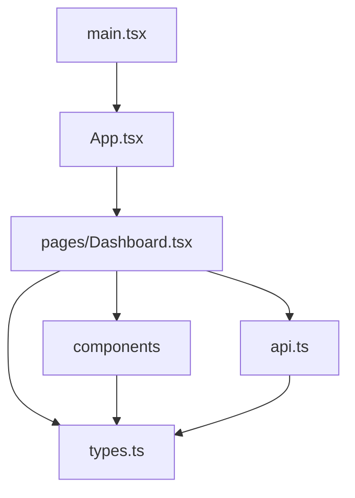

# Frontend source

This directory contains the browser application source. It is compiled under strict TypeScript settings and organized so transport, shared contracts, reusable UI, and page orchestration remain separate.

See [frontend/README.md](../README.md) for commands and deployment.

## Dependency direction



Allowed direction:

```text
entrypoint -> application -> pages -> components
                           -> API client
                           -> shared types
components ----------------> shared types
API client ----------------> shared types
```

Components must not import pages. Shared types must not import React or application modules.

## Files and directories

| Path | Responsibility |
| --- | --- |
| `main.tsx` | Validate the root element and mount React StrictMode |
| `App.tsx` | Application root and future top-level providers |
| `api.ts` | Axios configuration, endpoint functions, mapping, errors, and cancellation |
| `api.test.ts` | Transport contract regression tests |
| `types.ts` | Shared API, selector, and chart interfaces |
| `vite-env.d.ts` | Vite browser and `import.meta.env` typings |
| `components/` | Reusable presentation and interaction units |
| `pages/` | Page-level state, effects, and feature orchestration |
| `test/setup.ts` | DOM cleanup and Testing Library matchers |

## Entrypoint

`main.tsx`:

1. Loads Leaflet CSS.
2. Locates `#root`.
3. Throws a clear error when the host page is malformed.
4. Creates the React root.
5. Renders `App` under StrictMode.

Avoid adding feature logic to the entrypoint. Global providers may wrap `App`, but requests and page state belong below it.

## Shared contracts

`types.ts` is the single source for frontend data shapes.

Rules:

- Use interfaces for object contracts.
- Use camelCase in browser-facing shapes.
- Keep API response types distinct from selector types when mapping adds UI fields.
- Keep chart-specific transformations outside raw API types.
- Do not use `any`.
- Use `unknown` for caught values and narrow them safely.
- Update API and page tests when a contract changes.

Backend Pydantic changes should trigger a matching frontend type review.

## API boundary

Only `api.ts` should import Axios.

Endpoint functions must:

- Declare argument types.
- Declare explicit Promise return types.
- Pass an optional AbortSignal.
- Use backend parameter names exactly.
- Return typed data rather than Axios response objects.
- Perform necessary API-to-UI mapping.
- Preserve FastAPI error details.
- Avoid embedding component state decisions.

Do not fetch directly from selectors or chart components.

## Pages and components

Pages own:

- Network effects.
- Selection state.
- Loading state.
- Error state.
- Request cancellation.
- Feature composition.
- Conversion from API points to chart points.

Components own:

- Rendering.
- Local interaction required by the component.
- Accessible labels.
- Typed callbacks.
- Resource cleanup created by the component.

See:

- [components/README.md](components/README.md)
- [pages/README.md](pages/README.md)

## Lazy boundaries

`Dashboard.tsx` dynamically imports map and chart modules.

This is intentional:

- Leaflet is not needed before a country is selected.
- Plotly is not needed before data is available.
- The initial application chunk stays smaller.
- Expensive libraries remain isolated in cacheable chunks.

Do not move these imports back to the static import section without measuring bundle impact.

## Testing

Source tests are colocated with the layer they protect:

```text
api.ts                    -> api.test.ts
pages/Dashboard.tsx       -> pages/Dashboard.test.tsx
```

Shared setup runs from `test/setup.ts`.

Use Testing Library queries based on roles, labels, and visible text. Avoid testing internal hook implementation when public behavior is observable.

Run:

```powershell
npm test
npm run build
```

The build command is also the strict TypeScript check.

## TypeScript conventions

- Keep `strict: true`.
- Prefer inferred local types when obvious.
- Add explicit public function return types.
- Use `import type` for type-only imports.
- Narrow `unknown` errors.
- Avoid non-null assertions when a runtime guard is clearer.
- Prefer immutable mapping over in-place mutation.
- Use optional parameters for AbortSignals.
- Keep DOM event types explicit when handlers are non-trivial.
- Preserve exhaustive status or state handling.

## Adding an endpoint

When the backend adds or changes an endpoint:

1. Update the Pydantic backend model.
2. Add or update the matching interface in `types.ts`.
3. Add a typed function in `api.ts`.
4. Add request and response assertions in `api.test.ts`.
5. Integrate the function in a page hook or handler.
6. Add user-visible loading, empty, and error behavior.
7. Add a page test for the new flow.
8. Run tests and the production build.
9. Update the relevant READMEs.

## Adding a component

1. Define its props interface next to the component.
2. Import shared domain types from `types.ts`.
3. Keep API calls outside the component.
4. Provide semantic controls and accessible names.
5. Clean up Blob URLs, timers, map handlers, or other resources.
6. Add a test when the component has meaningful behavior.
7. Document the component in `components/README.md`.

## Quality checklist

Before committing source changes:

- No implicit `any`.
- No direct Axios use outside `api.ts`.
- No duplicated domain interfaces.
- No stale request can update current state.
- Loading, empty, and failure paths are visible.
- Interactive controls have accessible names.
- Tests cover corrected behavior.
- `npm test` passes.
- `npm run build` passes.
- Documentation matches the implementation.
